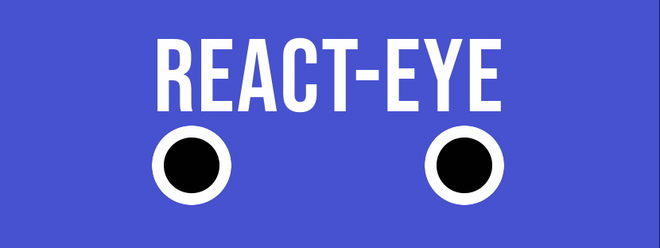

# About
Eye Component follows mouse


# Usage
npm:
```shell
npm i react-eye
```

yarn:
```shell
yarn add react-eye
```
## Getting started with react-eye
```ts
import * as React from "react";
import Eye from "react-eye";

function App() {
return (
    <>
      <Eye
        white={{
          x: 150,
          y: 150,
        }}
        iris={{
          x: 100,
          y: 100,
          color: "chocolate",
        }}
      />
    </>
  )
}
```

## props
|name|type|description|
|-|-|-|
|white|{ x: number; y: number; }|configuration for white part of eye, x is for vertical, y is for horizontal size|
|iris|{ x: number; y: number; color?: string; }|configuration for iris. x is for vertical, y is for horizontal size, color for iris fill|
|controlerRef|React.MutableRefObject<{ watch: (targetPosition: { x: number; y: number }) => void; }>| ref reception for controler, for now only "watch" will back.that make focus for target position specified|
|throttleInterval|number|specify throttle interval for mouse trace|


# Contributing
Thanks so much for your interest!
Any suggestion and pull requests are welcome!! 

# License
[MIT](https://choosealicense.com/licenses/mit/)

